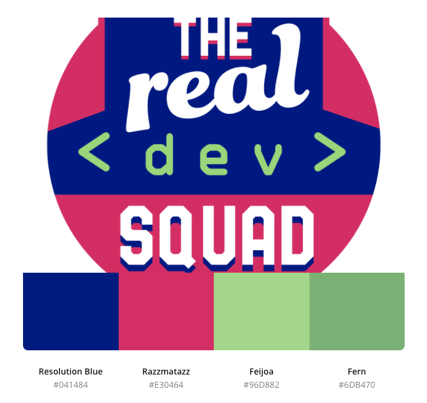

# Real Dev Squad Coding Documentation

Purpose of this repo is to help understand how we go around contributing and colloborating the code for our suite of apps.

## Our apps

You can read up on how we work upon our various projects [here](/docs/apps)

## Color Palette

 Name           | Hex Code
:---------------|----------
Resolution Blue | #041484
Razzmatazz      | #E30464
Feijoa          | #96D882
Fern            | #6DB470

Generated using [canva.com](https://www.canva.com/colors/color-palette-generator/)

## To Do
- [x] Setup basic repo
- [ ] Create `docs` folder with basic documentation
- [ ] Ensure that the link to the repo is available in all site apps and on the app pages
