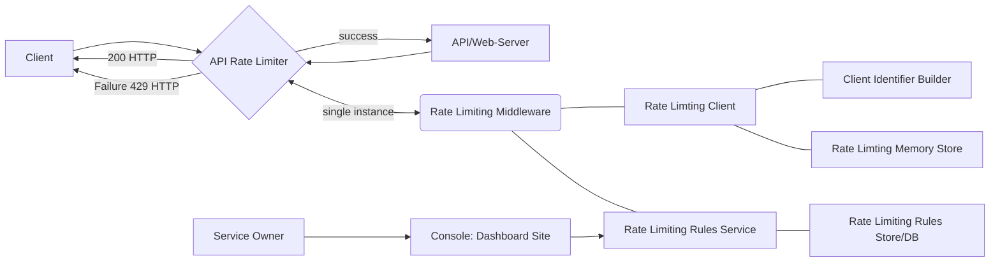

# Rate Limiting

Rate Limiting is an service for ensuring the flow of data being sent at the
routes can be digested at an acceptable rate

## Checklist

- [ ] Rate Limiter Design `[In Progress]`
- [ ] Role Based Limiting `[In Progress | YET To Add in Design]`
- [ ] Route Based Limiting `[In Progress | YET To Add in Design]`
- [ ] Identifying Unique IP Behind Proxy
- [ ] Idenitifying Unique IP Behind Public IP
- [ ] Use UserId or Username as UID on Possible Routes
- [ ] Common Acceptable Rate
- [ ] Configuration Via Dashboard Site

## Some More Info

- Package used for rate-limiting:
  [node-rate-limiter-flexible](https://github.com/animir/node-rate-limiter-flexible)
- Here Rate Limiter is internal rate limiter for digesting or servicing users
  requests at an acceptable rate.
- Here Rate Limiter use case is for user expirence and security, not for
  reducing operational costs.
- Here Rate Limiter is for single web service or single data center.
- Level of Rate Limting:
  - User
  - IP

### Rate Limiter Design

## Refferences

- [Why, where, and when should we throttle or rate limit?](https://www.youtube.com/watch?v=CW4gVlU0xtU)
- [System Design Interview - Rate Limiting (local and distributed)](https://www.youtube.com/watch?v=FU4WlwfS3G0)
- [System Design Mock Interview: Design a Rate Limiter (with Meta Engineering Manager)](https://www.youtube.com/watch?v=SgWb6tWx3S8)
