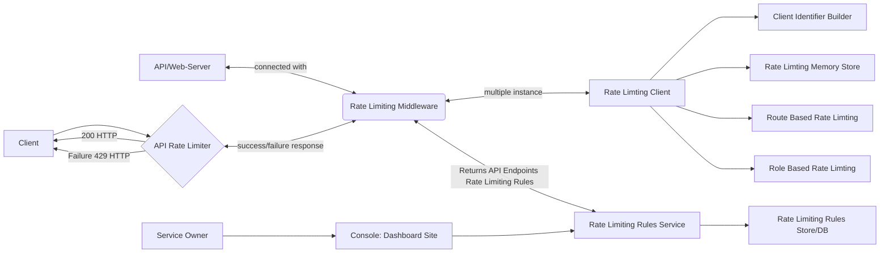
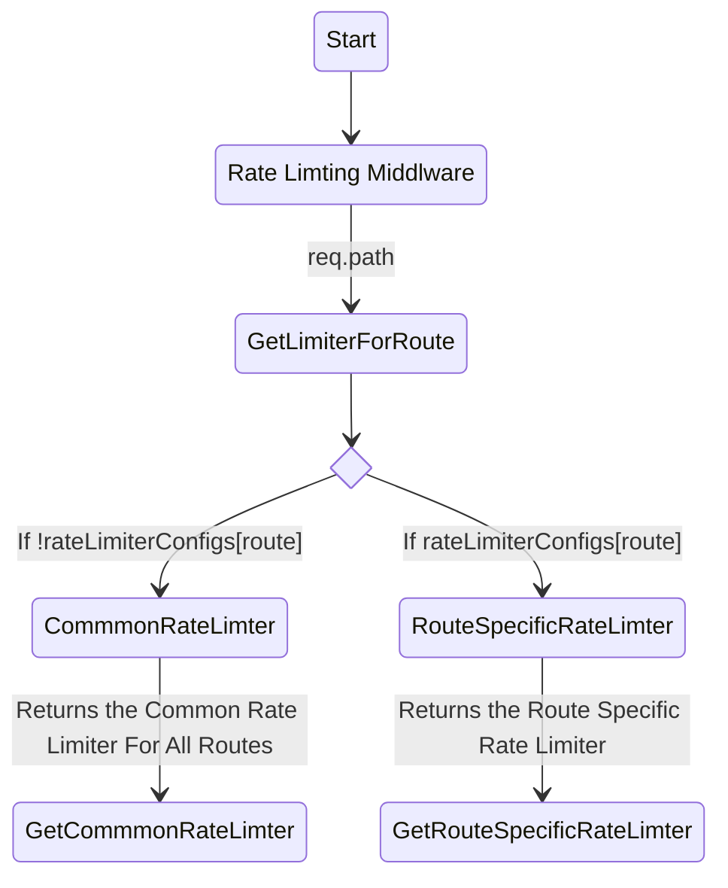
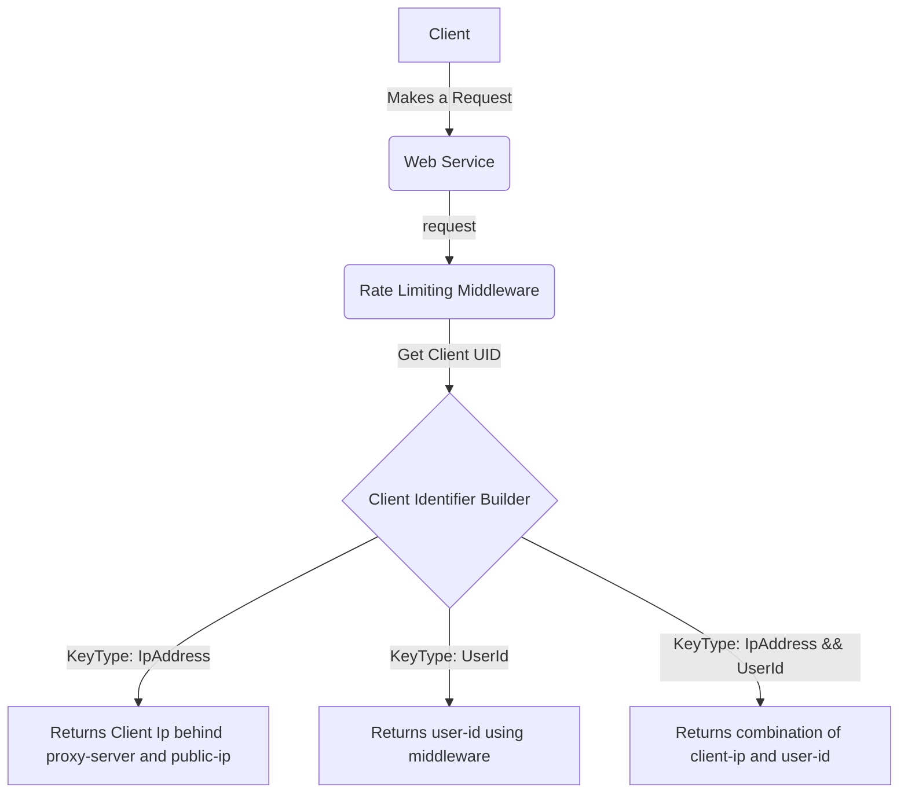
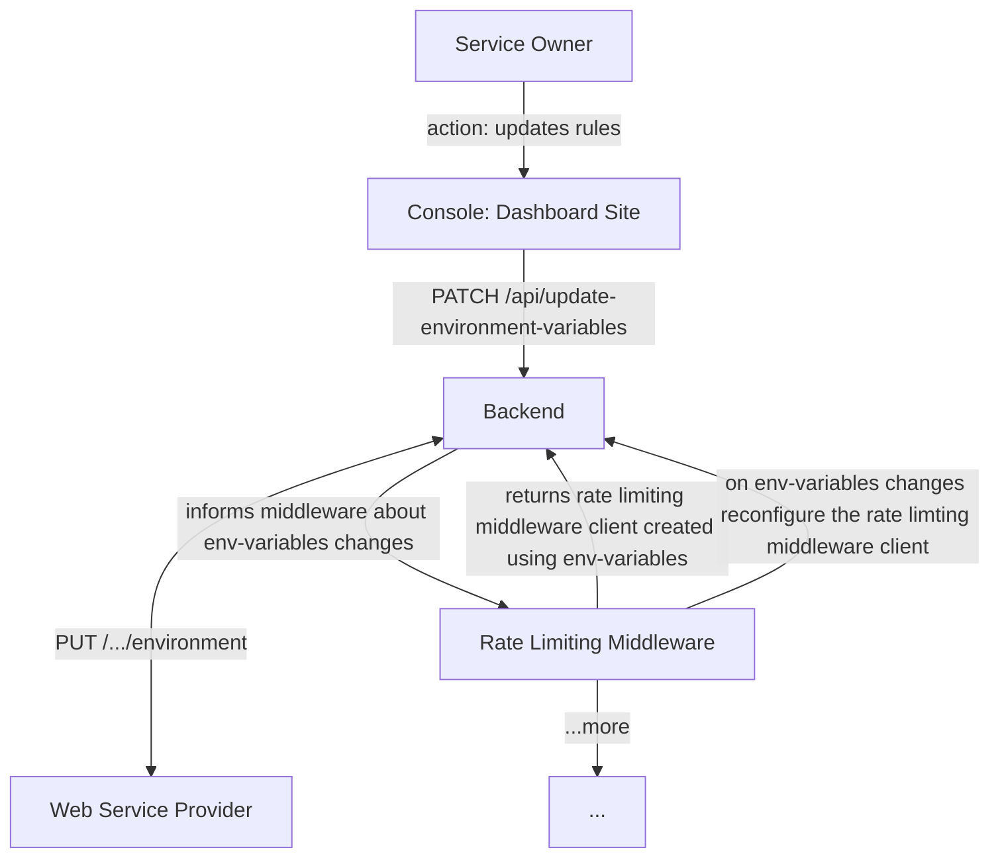

# Rate Limiting

Rate Limiting is a service for ensuring the flow of data being sent at the
routes can be digested at an acceptable rate.

<details>

<summary>Rate Limiting In Brief</summary>

> <p>Rate Limiting is a tool that helps control the amount of data or requests that
> can be sent to a particular service or route over a certain period of time. It
> is designed to prevent an overwhelming amount of traffic from flooding a system
> and causing it to malfunction or crash. By limiting the rate at which data is
> sent, the system can process and handle the data more efficiently and avoid
> overload. This ensures that the system remains stable and responsive to user
> requests.</p>

</details>

<details>

<summary>Pesudo Code</summary>

```js
const { RateLimiterMemory } = require('rate-limiter-flexible');

// Set up rate limiter
const rateLimiter = new RateLimiterMemory({
  points: 10, // number of requests allowed
  duration: 1, // time interval in seconds
  blockDuration: 60, // block duration in seconds
});

// Rate limiting middleware
function rateLimit(req, res, next) {
  rateLimiter
    .consume(req.ip)
    .then(() => {
      next();
    })
    .catch(() => {
      res.status(429).send('Too many requests');
    });
}

app.get('/api/data', rateLimit, (req, res) => {
  res.send('Success!');
});
```

</details>

## Checklist

- [x] Rate Limiter Design
- [ ] Role Based Limiting `[Yet to identify acceptable rate]`
- [x] Route-Based Limiting
- [x] Identifying Unique IP Behind Proxy
- [ ] Identifying Unique IP Behind Public IP `[Yet to add pseudo code]`
- [x] Client UID Identifier or Builder
- [ ] Common Acceptable Rate `[Yet to research on acceptable rate]`
- [x] Rate Limiting Rules Configuration Via Dashboard Site

---

## Some More Info

- Package used for rate-limiting:
  [node-rate-limiter-flexible](https://github.com/animir/node-rate-limiter-flexible)
- Level of Rate Limiting:
  - User
  - IP
- Here Rate Limiter is an internal rate limiter for servicing users requests at
  an acceptable rate.
- Here Rate Limiter use case is for user experience and security, not for
  reducing operational costs.
- Here Rate Limiter use case is for a single web service instance.

---

### Rate Limiter Design



<details>

<summary>Explanation</summary>

> This is a flowchart that represents the architecture of a rate limiting system
> that uses multiple components to control the rate of incoming requests to an
> API or web server.

> The flowchart shows a client that sends requests to a server through an API
> rate limiter (ARL). If the request rate is within the allowed limits, the
> server sends a successful 200 HTTP response back to the client. If the request
> rate exceeds the limit, the API rate limiter sends a failure 429 HTTP response
> to the client indicating that the request has been rejected.

> The API rate limiter communicates with a rate limiting middleware (RLM) using
> a two-way arrow, which means that there is communication between the two
> components in both directions. The rate limiting middleware is responsible for
> handling rate limiting logic, which includes multiple instances of a rate
> limiting client (RLC), a rate limiting rules service (RLRS), a client
> identifier builder (CIDB), a rate limiting memory store (RLMS), route-based
> rate limiting (RBRLM), and role-based rate limiting (ROBRLM).

> The rate limiting rules service communicates with a rate limiting rules
> store/database (RLRDB), which is accessible through a console/dashboard site
> (RLRC) for the service owner.

> Overall, the flowchart represents a system that uses multiple components to
> control the rate of incoming requests to an API or web server, which helps to
> prevent the server from being overloaded and ensures that the service remains
> available to users.

</details>

### Route Based Limiting



<details>

<summary>Explanation</summary>

> This is a state diagram that shows the logic of selecting a rate limiter for a
> specific route in a web server or API.

> The state diagram starts with an initial state that does not have any specific
> name or label, represented by an asterisk. From there, it moves to a state
> labeled "Rate Limiting Middleware" (RLM), which is responsible for handling
> rate limiting logic in the system.

> From the RLM state, the diagram shows a transition to a state labeled
> "GetLimiterForRoute", which retrieves the appropriate rate limiter for the
> current route based on the path of the incoming request. The
> GetLimiterForRoute state then moves to a decision state labeled "if_state"
> that evaluates whether there is a specific rate limiter configuration for the
> current route.

> If there is no specific rate limiter configuration for the current route, the
> diagram shows a transition from the if_state state to a state labeled
> "CommonRateLimter" that returns the common rate limiter for all routes. The
> GetCommmonRateLimter state then returns the common rate limiter to the RLM
> state.

> If there is a specific rate limiter configuration for the current route, the
> diagram shows a transition from the if_state state to a state labeled
> "RouteSpecificRateLimter" that returns the route-specific rate limiter for the
> current route. The GetRouteSpecificRateLimter state then returns the
> route-specific rate limiter to the RLM state.

> Overall, the state diagram represents a system that selects the appropriate
> rate limiter for each incoming request based on the route of the request. This
> allows the system to apply different rate limiting rules to different routes,
> or to use a common rate limiter for all routes if no specific rules are
> defined. This can help to prevent server overload and ensure that the service
> remains available to users.

</details>

<details>
<summary>
Pesudo code
</summary>

```ts
const rateLimiter = require('node-rate-limiter-flexible');

// Create a common rate limiter instance with default options
const commonRateLimiter = new rateLimiter.RateLimiterMemory({
  points: 100,
  duration: 60,
});

// Define rate limiter configurations for specific routes
const rateLimiterConfigs = {
  '/route1': {
    points: 50,
    duration: 60,
  },
  '/route2': {
    points: 20,
    duration: 60,
  },
  // ...
};

// Create a map to store rate limiter instances for specific routes
const routeRateLimiters = new Map();

// Middleware function to apply rate limiting for specific routes
function specificRateLimiterMiddleware(req, res, next) {
  const routeRateLimiter = getLimiterForRoute(req.path);

  routeRateLimiter
    .consume(req.ip)
    .then(() => {
      next();
    })
    .catch(() => {
      res.status(429).send('Too many requests');
    });
}

// Function to get the rate limiter instance for a specific route
function getLimiterForRoute(route) {
  if (rateLimiterConfigs[route]) {
    if (!routeRateLimiters.has(route)) {
      routeRateLimiters.set(
        route,
        new rateLimiter.RateLimiterMemory(rateLimiterConfigs[route])
      );
    }
    return routeRateLimiters.get(route);
  } else {
    return commonRateLimiter;
  }
}
```

</details>

### Client Unqiue Identifier or Builder



<details>

<summary>Explanation</summary>

> The given flowchart represents a flow of data between the client, web service,
> and rate limiting middleware. The client sends a request to the web service,
> which then goes through the rate limiting middleware. The middleware is
> responsible for getting the client UID (unique identifier) and determining
> what type of key it should be based on the request.

> To build the client UID, the middleware uses the client identifier builder
> (C). This builder can create different types of keys, including IpAddress,
> UserId, and a combination of both.

> If the key type is IpAddress, the builder (C) returns the client IP address
> behind the proxy server and the public IP. If the key type is UserId, it
> returns the user ID using middleware. And if the key type is a combination of
> both (IpAddress && UserId), the builder (C) returns the combination of the
> client IP and user ID.

> Overall, this flowchart explains how the rate limiting middleware is
> responsible for getting the client UID using the client identifier builder and
> its different key types.

</details>

<details>
<summary>Pesudo Code</summary>

```ts
function getClientUniqueIdentifier(request, type = 'ipaddress') {
  const ipAddress = getClientIp(request);
  const userId = request.userData.id;

  if (type === 'userId') {
    return userId;
  } else if (type === 'combo') {
    return `key-${ipAddress}_${userId}`;
  }
  return ipAddress;
}

function getClientIp(request) {
  const xForwardedForHeader = req.headers['x-forwarded-for'];
  if (xForwardedForHeader && typeof xForwardedForHeader === 'string') {
    return xForwardedForHeader.split(',')[0].trim();
  } else if (request.connection && request.socket.remoteAddress) {
    return request.socket.remoteAddress;
  } else {
    return request.ip;
  }
}
```

</details>

### Rate Limiting Rules Configuration Via Dashboard Site



<small>`Alternative:` cache-service or databse to store rate limiting rules
service instead of environment variables</small>

<details>

<summary>Explanation</summary>

> This flowchart describes the process of updating rate limiting rules for a web
> service.

> The Service Owner (SO) initiates the process by updating the rules, which are
> stored in the Console Dashboard Site (RLRC). These updates are sent to the
> Backend (BEND) via a PATCH request to the /api/update-environment-variables
> endpoint.

> Once received, the Backend sends the updated environment variables to the
> Backend Hoisting Service Provider (BHSP), which updates the environment
> variables accordingly. The Rate Limiting Middleware (RLM) then returns the
> rate limiting middleware client, which is created using these environment
> variables, to the Backend.

> The Backend then informs the middleware of the changes, and the middleware
> reconfigures the client accordingly. This process can occur repeatedly, with
> the RLM continuing to reconfigure the client on any subsequent changes to the
> environment variables.

> The flowchart ends with ...more, indicating that there may be additional steps
> or actions beyond those depicted in the diagram.

</details>

<details>

<summary> Dashboard Site: Rough Figma Design To Update API Rules </summary>

<p align="center">

</p>
</details>

<details>
<summary>Pesudo Code</summary>

```ts
//TODO: write code for both dashboard and backend

// Dashboard site

// Backend server
```

</details>

### Role Based Rate Limiting

### Common Acceptable Rate

Here we have to pass four parameters to create a rate limiter client:

- keyPrefix: The unique identifier for the client or user being rate-limited,
  such as their IP address or user ID.
- points: The number of requests that are allowed within a given duration.
- duration: The length of time during which requests are counted towards the
  rate limit.
- blockDuration: The length of time a client is blocked from making requests
  after exceeding the rate limit.

```ts
//INFO: rate limiter which allows maxium of 5 requests / 30 seconds and blocks user for 10 minutes if limit is reach or points are consumed
const rateLimiter = new RateLimiterMemory({
  keyPrefix: 'login_fail_by_ip_per_minute',
  points: 5,
  duration: 30,
  blockDuration: 60 * 10,
});
```

---

## Contributions

- [@prakashchoudhary07 ](https://github.com/prakashchoudhary07) suggested to add
  route-based rate limiting
- [@ivinayakg](https://github.com/ivinayakg) suggested to use environment
  variables for rate limiter middleware rules
- [@heyrandhir](https://github.com/heyrandhir) suggested to add role-based rate
  limiting
- [@ankushdharkar](https://github.com/ankushdharkar) suggested to use dashboard
  site for creating and updating rate limiter rules

## Refferences

- [Why, where, and when should we throttle or rate limit?](https://www.youtube.com/watch?v=CW4gVlU0xtU)
- [System Design Interview - Rate Limiting (local and distributed)](https://www.youtube.com/watch?v=FU4WlwfS3G0)
- [System Design Mock Interview: Design a Rate Limiter (with Meta Engineering Manager)](https://www.youtube.com/watch?v=SgWb6tWx3S8)
- [Chat GPT](https://chat.openai.com/chat)
