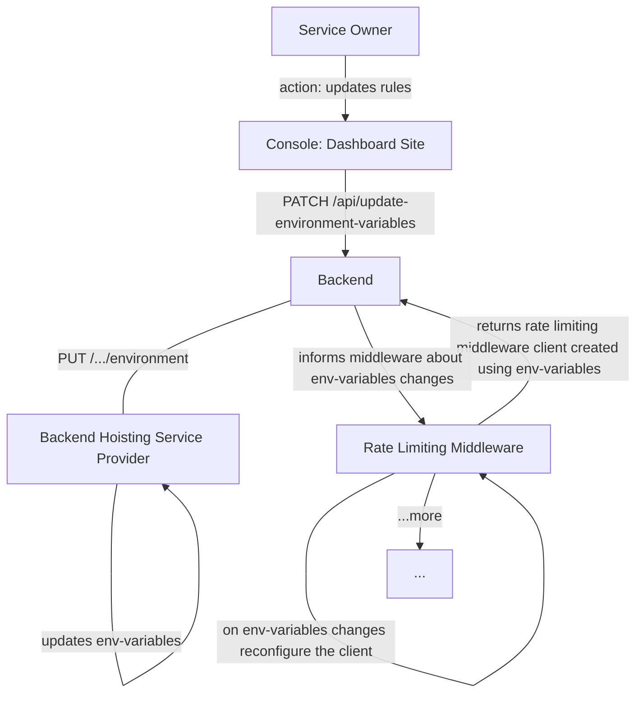

# Rate Limiting

Rate Limiting is an service for ensuring the flow of data being sent at the
routes can be digested at an acceptable rate

## Checklist

- [x] Rate Limiter Design
- [ ] Role Based Limiting `[Yet to identify acceptable rate]`
- [x] Route Based Limiting
- [x] Identifying Unique IP Behind Proxy
- [ ] Idenitifying Unique IP Behind Public IP
- [x] Client UID Identifier or Builder
- [ ] Common Acceptable Rate `[Yet to research on acceptable rate]`
- [x] Rate Limiting Rules Configuration Via Dashboard Site

---

## Some More Info

- Package used for rate-limiting:
  [node-rate-limiter-flexible](https://github.com/animir/node-rate-limiter-flexible)
- Here Rate Limiter is internal rate limiter for digesting or servicing users
  requests at an acceptable rate.
- Here Rate Limiter use case is for user expirence and security, not for
  reducing operational costs.
- Here Rate Limiter is for single web service or single data center.
- Level of Rate Limting:
  - User
  - IP

---

### Rate Limiter Design


### Route Based Limiting


<details>
<summary>
Pesudo code
</summary>

```ts
const rateLimiter = require('node-rate-limiter-flexible');

// Create a common rate limiter instance with default options
const commonRateLimiter = new rateLimiter.RateLimiterMemory({
  points: 100,
  duration: 60,
});

// Define rate limiter configurations for specific routes
const rateLimiterConfigs = {
  '/route1': {
    points: 50,
    duration: 60,
  },
  '/route2': {
    points: 20,
    duration: 60,
  },
  // ...
};

// Create a map to store rate limiter instances for specific routes
const routeRateLimiters = new Map();

// Middleware function to apply rate limiting for specific routes
function specificRateLimiterMiddleware(req, res, next) {
  const routeRateLimiter = getLimiterForRoute(req.path);

  routeRateLimiter
    .consume(req.ip)
    .then(() => {
      next();
    })
    .catch(() => {
      res.status(429).send('Too many requests');
    });
}

// Function to get the rate limiter instance for a specific route
function getLimiterForRoute(route) {
  if (rateLimiterConfigs[route]) {
    if (!routeRateLimiters.has(route)) {
      routeRateLimiters.set(
        route,
        new rateLimiter.RateLimiterMemory(rateLimiterConfigs[route])
      );
    }
    return routeRateLimiters.get(route);
  } else {
    return commonRateLimiter;
  }
}
```

</details>

<br>

### Client Unqiue Identifier or Builder


<details>
<summary>Pesudo Code</summary>

```ts
function getClientUniqueIdentifier(request, type = 'ipaddress') {
  const ipAddress = getClientIp(request);
  const userId = request.userData.id;

  if (type === 'userId') {
    return userId;
  } else if (type === 'combo') {
    return `key-${ipAddress}_${userId}`;
  }
  return ipAddress;
}

function getClientIp(request) {
  const xForwardedForHeader = req.headers['x-forwarded-for'];
  if (xForwardedForHeader && typeof xForwardedForHeader === 'string') {
    return xForwardedForHeader.split(',')[0].trim();
  } else if (request.connection && request.socket.remoteAddress) {
    return request.socket.remoteAddress;
  } else {
    return request.ip;
  }
}
```

</details>

<br>

### Rate Limiting Rules Configuration Via Dashboard Site



<small>`Alternative:` cache-service or databse to store rate limiting rules
service instead of environment variables</small>

<br>

##### `Dashboard Site:` Rough Figma Design To Update API Rules

<p align="center">

</p>

<details>
<summary>Pesudo Code</summary>

```ts
//TODO: write code for both dashboard and backend

// Dashboard site

// Backend server
```

</details>

---

## Refferences

- [Why, where, and when should we throttle or rate limit?](https://www.youtube.com/watch?v=CW4gVlU0xtU)
- [System Design Interview - Rate Limiting (local and distributed)](https://www.youtube.com/watch?v=FU4WlwfS3G0)
- [System Design Mock Interview: Design a Rate Limiter (with Meta Engineering Manager)](https://www.youtube.com/watch?v=SgWb6tWx3S8)
